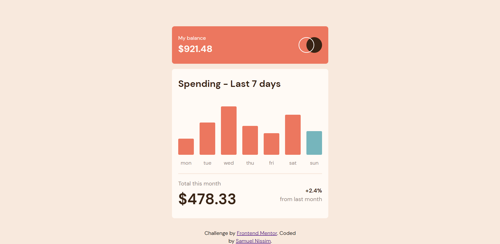
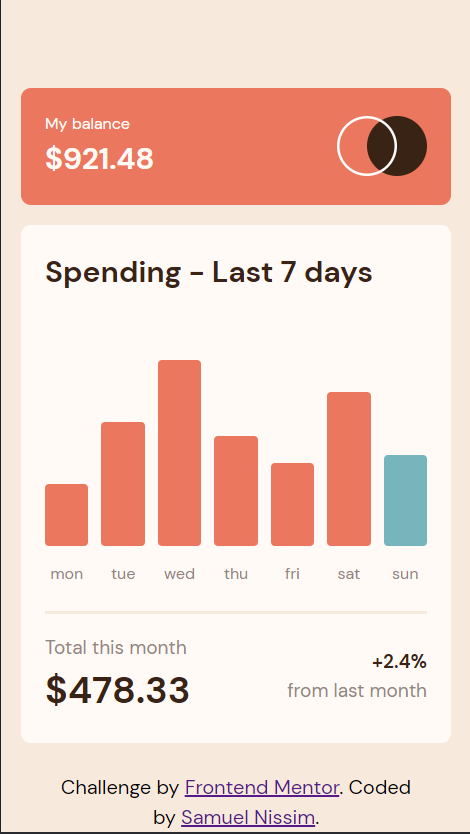

# Frontend Mentor - Expenses chart component solution

This is a solution to the [Expenses chart component challenge on Frontend Mentor](https://www.frontendmentor.io/challenges/expenses-chart-component-e7yJBUdjwt). Frontend Mentor challenges help you improve your coding skills by building realistic projects. 

## Table of contents

- [Overview](#overview)
  - [The challenge](#the-challenge)
  - [Screenshot](#screenshot)
  - [Links](#links)
- [My process](#my-process)
  - [Built with](#built-with)
  - [What I learned](#what-i-learned)
  - [Continued development](#continued-development)
- [Author](#author)
- [Acknowledgments](#acknowledgments)

## Overview

### The challenge

Users should be able to:

- View the bar chart and hover over the individual bars to see the correct amounts for each day
- See the current day’s bar highlighted in a different colour to the other bars
- View the optimal layout for the content depending on their device’s screen size
- See hover states for all interactive elements on the page
- **Bonus**: Use the JSON data file provided to dynamically size the bars on the chart

### Screenshot




### Links

- Solution URL: [My GitHub](https://github.com/samnismolvel/expense-card)
- Live Site URL: [Live Site](https://samnismolvel.github.io/expense-card/)

## My process

### Built with

- Semantic HTML5 markup
- CSS custom properties
- Flexbox
- CSS Grid
- Mobile-first workflow
- Vanilla JS


### What I learned

In my first Frontend Mentor project I didn't really used utility classes for the CSS,
I noticed how organized and clever were other solutions with a much better utility class
approach. So, I did my best in this one to jump into that approach and write less while
implementing what I wrote into many elements. Also, my code for responsiveness, the methods I used were... yeah... not very good, Thanks to @elaineleung for letting me know about it and recommend me some alternatives such as min-width, min-height, clamp, etc, I really noticed how easier and cleaner this options are. 

For my js, I did my first async functions, as well as my first fetch(). At the beggining I did have trouble wondering why I couldn't use data from an async process in a sync one... then... yeah, I read the docs .-. 

Have a lot of fun with this one, it's still junior and not very large, but im learning to learn. 

First time I use custom properties and min():
```css
.mid-section--column {
  height: 100%;
  width: min(100%, 3rem);

  justify-content: flex-end;
  --flex-gap: 0.8rem;
```

Fist time using async/await and fetch():
```js
const getJsonData = async()=>{
   let promResponse = await fetch("data.json");
   let jsonData = await promResponse.json();
   
   return Array.from(jsonData);
 };
```
### Continued development

I want to improve my js and do bigger and more complex projects.

## Author

- Website - [Samuel Nissim](https://github.com/samnismolvel)
- Frontend Mentor - [@samnismolvel](https://www.frontendmentor.io/profile/samnismolvel)

## Acknowledgments

Again, thanks to @elaineleung for the recommendations, and to Kevin Powell, whose work as a content creator on CSS has taught me a lot.
